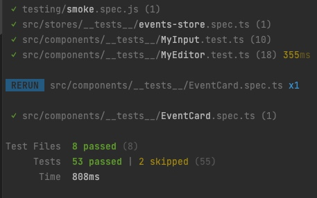

# vue-test-concepts

This repo was created as `npm init vue` and adding ts, pinia, vitest, cypress.

I have merged (copied!) some features / testing components from [Vue Mastery - Real World Testing](https://github.com/Code-Pop/real-world-testing)
           
Technologies used in this repo;
 * [Vue 3](https://vuejs.org/) client side framework ... plus TypeScript
 * [Pinia](https://pinia.vuejs.org/) client-side Data store
 * [Vite](https://vitejs.dev/) build system
 * [Vitest](https://vitest.dev/) for Unit Testing
 * [Vue Test Utils](https://test-utils.vuejs.org/) add-on testing library
 * [Cypress](https://www.cypress.io/) for component AND e2e tests  
 * and some associated details ...
   * [Axios](https://axios-http.com/docs/intro) for simulated remote API requests
   * [json-server](https://www.npmjs.com/package/json-server#getting-started) for storage of fake database data for testing
   * [Mock Service Worker](https://mswjs.io/docs/getting-started/mocks/rest-api) for mocking API requests during testing




## Testing Roadmap

### Unit Tests
We use [Vitest](https://vitest.dev/) for unit testing.  
 * it scans the src/ folder and identifies any `.spec.xx` or `.test.` files and processes them
 * this includes JS or TS, or theoretically JSX files
 * My [`vitest.config.js`](vitest.config.ts) includes `globals:true` which means that you don't need to import keywords from vitest
   * But, I noticed my IDE is not happy with that ...
   * so I still mostly do `import {describe,it,expect,beforeEach} from 'vitest'` in each spec file
 * I really like the *speed* ⚡️ of Vitest 
 * and the .skip, .only helpers are very handy

To run unit tests simply do;
```sh
vite --environment jsdom
```
Vite includes really nice coverage reporting (using [c8](https://github.com/bcoe/c8)) and it is enabled at runtime as;
```sh
vite --environment jsdom --coverage
```
#### Issues with unit testing

 * I use `@vue/test-utils` in this repo and it is extremely helpful for mounting and providing getters and helpers.
   * This library applies a `nextTick()` to all DOM related items (.click, .setValue)
 * Refer to [Pinia - Unit Testing components](https://pinia.vuejs.org/cookbook/testing.html) for excellent examples of how to setup stores during unit tests
   * install `@pinia/testing`
   * i.e. use mount `global.plugins[ createTestingPinia()]`
   * and you can load initialState when mounting components


### Component tests (Cypress)

I've relied a lot on @_jessicasachs 
Great videos / tutorials / repos
 * Jessica's GH repo [stress-free-testing](https://github.com/JessicaSachs/stress-free-testing/tree/10-stores)
 * Video [Component testing with Vue/Vite/Cypress - VueConf 2021](https://www.vuemastery.com/conferences/vueconf-us-2021/component-testing-with-vite-vue-and-cypress/)
   * basically a live coding video ...
 * 

    
### End-to-End Integration (Cypress)


<hr> 
## Configuration / Runs

### Customize configuration

See [Vite Configuration Reference](https://vitejs.dev/config/).

### Project Setup

```sh
yarn install # or npm install 
```

#### Compile and Hot-Reload for Development

```sh
yarn run dev # or npm run dev
```

#### Type-Check, Compile and Minify for Production

```sh
yarn run build # or npm run build
```

#### Run Unit Tests with [Vitest](https://vitest.dev/)

```sh
yarn run test:unit # or npm run test:unit
```

#### Run End-to-End Tests with [Cypress](https://www.cypress.io/)

```sh
# cypress open # first run cypress to setup
npm run build
npm run test:e2e # or `npm run test:e2e:ci` for headless testing
```

OR for Cypress component testing

```sh
npx cypress open --component
```

<hr>

## Recommended IDE Setup

[VSCode](https://code.visualstudio.com/) + [Volar](https://marketplace.visualstudio.com/items?itemName=Vue.volar) (and disable Vetur) + [TypeScript Vue Plugin (Volar)](https://marketplace.visualstudio.com/items?itemName=Vue.vscode-typescript-vue-plugin).

## Type Support for `.vue` Imports in TS

TypeScript cannot handle type information for `.vue` imports by default, so we replace the `tsc` CLI with `vue-tsc` for type checking. In editors, we need [TypeScript Vue Plugin (Volar)](https://marketplace.visualstudio.com/items?itemName=Vue.vscode-typescript-vue-plugin) to make the TypeScript language service aware of `.vue` types.

If the standalone TypeScript plugin doesn't feel fast enough to you, Volar has also implemented a [Take Over Mode](https://github.com/johnsoncodehk/volar/discussions/471#discussioncomment-1361669) that is more performant. You can enable it by the following steps:

1. Disable the built-in TypeScript Extension
   1) Run `Extensions: Show Built-in Extensions` from VSCode's command palette
   2) Find `TypeScript and JavaScript Language Features`, right click and select `Disable (Workspace)`
2. Reload the VSCode window by running `Developer: Reload Window` from the command palette.
